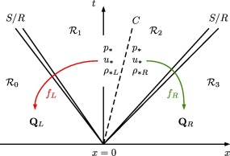
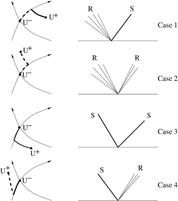

# Iterative Riemann Solver
Iterative Riemann solver (based on Newton-Raphson iteration method)

## Background
  The following two equations help us to solve a Riemann problem,

  ```math
  \begin{aligned}
  & f_L(p_*, U_L) + f_R(p_*, U_R) + \Delta u = 0 \\
  & u^* = \frac 1 2 (u_L + u_R) + \frac 1 2
  \left[
    f_R(p_*, U_R) - f_L(p_*, U_L)
  \right]
  \end{aligned}
  ```

  The functions $`f_L`$ and $`f_R`$ represent relations across the left and the
  right nonlinear waves and are given by:

  ```math
  f_K (p_*, U_K) = \begin{cases}
    (p_* - p_K) ( \frac{ A_K }{ p_* + B_K } )^{1/2}
    & \text{if}\quad p_* \geq p_K \\
    & \\
    \frac{2 c_s^K}{\gamma - 1}
    \left[
      \left( \frac{p_*}{p_K} \right)^{ \frac{\gamma - 1}{2 \gamma} } - 1
    \right]
    & \text{if}\quad p_* < p_K
  \end{cases}
  ```

  where $`A_K = \frac{2}{(\gamma + 1) \rho_K}`$ and
  $`B_K = \frac{\gamma - 1}{\gamma + 1} p_K`$. The star region pressure
  can be solved by an
  iterative scheme using the first solution equation. Note that $`p_*`$ is
  a function of five variables, $`p_* (\Delta u, \rho_L, p_L, \rho_R, p_R)`$.
  After finding $`p_*`$, $`u*`$ can also be calculated by the second
  solution equation. The remaining unknowns are found by the means of standard
  gas dynamic relations.

  The following figure shows the star region, shock (S) or rarefaction (R)
  nonlinear waves, contact discontinuity (C) and flux functions in the $`x-t`$
  plane,

  

  The unknown region between $`u_L`$ and $`u_R`$ is the star region. Note that
  the middle wave is the contact discontinuity while the left and the right
  nonlinear waves are either shock or rarefaction waves. Therefore, according
  to the type of the nonlinear waves, there can be four possible wave
  configurations,

  

  Note that both pressure $`p_*`$ and velocity $`u_*`$ between left and right
  waves are constant, while the density takes on the two constant values
  $`\rho_{*L}`$ and $`\rho_{*R}`$.

### Finding $`p_*`$ iteratively
  Our aim here is to minimise or cancel the residual, $`R(p)`$, of the following
  equation using an iterative scheme (here the Newton-Raphson iteration method):

  ```math
  f_L(p, U_L) + f_R(p, U_R) + \Delta u = R(p)
  ```

  Newton-Raphson method requires the value of the function and its derivatives.
  We can analytically calculate the derivatives,

  ```math
  f_K^\prime (p_*, U_K) =
  \begin{cases}
    \sqrt{(\frac{A_K}{p + B_K})}
    \left(
      1 - \frac{p - p_K}{2 (B_k + p)}
    \right)
    & \text{if } p \geq p_K \\
    &  \\
    \frac{1}{\rho_K c_s^K}
    \left( \frac{p}{p_K} \right)^{\frac{- (\gamma + 1)}{2 \gamma}}
    & \text{if } p < p_K
  \end{cases}
  ```

  The most computationally expensive step is the calculation of the terms
  with fractional exponents. Considering the common terms of the
  function and its derivatives, we can avoid repeating these calculations.

  Finally, the Newton-Raphson iteration can be simply written as,

  ```math
  p_{i+1} = p_i - \frac{R_{(p_i)}}{R^\prime_{(p_i)}}
  ```

### Calculating $`u_*`$ based on a given $`p_*`$
  Having $`p_*`$ in hand, we are ready to calculate the particle velocity
  in the star region,

  ```math
  u_* = \frac 1 2 ( u_R - u_L ) + \frac 1 2 ( f_R - f_L )
  ```

### The Complete Solution and Sampling
  By identifying types of the left and the right nonlinear waves, we are able
  to compute $`\rho_{*L}`$ and $`\rho_{*R}`$. In order to specify the type of
  a nonlinear wave, we should compare the star region pressure, $`p_*`$, with
  the left or the right pressure, $`p_L`$ and $`p_R`$.

  For shock waves, we calculate the density behind the shock and the shock
  speed.

  For rarefactions, we calculate the density behind the wave, an equation
  for the head and the tail of the wave and the full solution inside
  the rarefaction region.

  Following, we go through different types of nonlinear waves.

#### Left shock wave ( $`p_* > p_L`$ )
  **Star region density ($`\rho_{*L}`$)**
  ```math
  \rho_{*L} = \rho_L
  \left[
    \frac
    {
      \frac{ p_* }{ p_L } + \frac{ \gamma - 1 }{ \gamma + 1 }
    }
    {
      \frac{ \gamma - 1 }{ \gamma + 1 } \frac{ p_* }{ p_L } + 1
    }
  \right]
  ```

  **Shock speed ($`S_L`$)**
  ```math
  S_L = u_L - c_{sL}
  \left[
    \frac{ \gamma + 1 }{ 2 \gamma } \frac{ p_* }{ p_L }
    + \frac{ \gamma - 1 }{ 2 \gamma }
  \right]^{ \frac 1 2 }
  ```

  **Sampling ($`\mathbf{W}(x, t)`$)**
  ```math
  \mathbf{W}(x, t) =
  \begin{cases}
    \mathbf{W}_{*L}^{\text{shock}} \quad
    &\text{if} \quad S_L \leq \frac x t \leq u_* \\
    &\\
    \mathbf{W}_L \quad &\text{if} \quad \frac x t \leq S_L
  \end{cases}
  ```

#### Left Rarefaction wave ( $`p_* \leq p_L`$ )
  **Star region density ($`\rho_{*L}`$)** follows the isentropic law,
  ```math
  \rho_{*L} = \rho_L
  \left(
    \frac{ p_* }{ p_L }
  \right)^{ \frac 1 \gamma }
  ```

  **Sound speed behind the rarefaction ($`c_{s*L}`$)**
  ```math
  c_{s*L} = c_s^L
  \left(
    \frac{ p_* }{ p_L }
  \right)^{ \frac{ \gamma - 1 }{ 2 \gamma } }
  ```

  **Rarefaction head and tail speeds ($`S_{HL}, S_{TL}`$)**
  ```math
  S_{HL} = u_L - c_s^L, \quad S_{TL} = u_* - c_s^{*L}
  ```

  **Solution inside the rarefaction ($`\mathbf{W}_{L\text{fan}}`)**
  ```math
  \mathbf{W}_{L\text{fan}} =
  \begin{cases}
    &\rho = \rho_L
    \left[
      \frac{2}{\gamma + 1} + \frac{\gamma - 1}{(\gamma + 1)\c_{sl}}
      \left(
        u_L - frac x t
      \right)
    \right]^{\frac{2}{\gamma - 1}}\\
    &\\
    &u = frac{2}{\gamma + 1}
    \left[
      c_{sL} + \frac{\gamma - 1}{2} u_L + \frac x t
    \right] \\
    &\\
    &p = p_L
    \left[
      \frac{2}{\gamma + 1} + \frac{\gamma - 1}{(\gamma + 1)c_{sL}}
      \left(
        u_L - \frac x t
      \right)
    \right]^{\frac{2\gamma}{\gamma - 1}}
  \end{cases}
  ```

  **Sampling ($`\mathbf{W}(x,t)`)**
  ```math
  \mathbf{W}(x,t) =
  \begin{cases}
    \mathbf{W}_{*L} \quad
    &\text{if} \quad \frac x t \leq S_{HL} \\
    &\\
    \mathbf{W}_{L\text{fan}} \quad
    &\text{if} \quad S_{HL} \leq \frac x t \leq S_{TL} \\
    &\\
    \mathbf{W}_{*L}^{\text{fan}} \quad
    &\text{if} \quad S_{TL} \leq \frac x t \leq u_*
  \end{cases}
  ```

  where $`\mathbf{W}_{*L}^{\text{fan}}`$ in $`x`$-direction is,

  ```math
  \mathbf{W}_{*L}^{\text{fan}} =
  \begin{cases}
    (rho_{*L}, u_*, v_L, w_L, p_*) \quad &\text{if} \quad frac x t < u_* \\
    &\\
    (rho_{*L}, u_*, v_R, w_R, p_*) \quad &\text{if} \quad frac x t > u_* \\
  \end{case}
  ```

#### Right shock wave ( $`p_* > p_R`$ )
  **Star region density ($`\rho_{*R}`)**
  ```math
  \rho_{*R} = \rho_R
  \left[
    \frac
    {
      \frac{ p_* }{ p_R } + \frac{ \gamma - 1 }{ \gamma + 1 }
    }
    {
      \frac{ \gamma - 1 }{ \gamma + 1 } \frac{ p_* }{ p_R } + 1
    }
  \right]
  ```

  **Shock speed ($`S_R`$)**
  ```math
  S_R = u_R - c_{sR}
  \left[
    \frac{ \gamma + 1 }{ 2 \gamma } \frac{ p_* }{ p_R }
    + \frac{ \gamma - 1 }{ 2 \gamma }
  \right]^{ \frac 1 2 }
  ```

  **Sampling ($`\mathbf{W}(x,t)`$)**
  ```math
  \mathbf{W}(x,t) =
  \begin{cases}
    \mathbf{W}_{*R}^{\text{sho}} \quad
    &\text{if} \quad u_* \leq \frac x t \leq S_R \\
    &\\
    \mathbf{W}_R \quad &\text{if} \quad \frac x t \geq S_R
  \end{cases}
  ```

#### Right Rarefaction wave ( $`p_* \leq p_R`$ )
  **Star region density ($`\rho_{*R}`$)** follows the isentropic law,
  ```math
  \rho_{*R} = \rho_R
  \left(
    \frac{ p_* }{ p_L }
  \right)^{ \frac 1 \gamma }
  ```

  **Sound speed behind the rarefaction ($`c_{s*R}`$)**
  ```math
  c_{s*R} = c_s^R
  \left(
    \frac{ p_* }{ p_L }
  \right)^{ \frac{ \gamma - 1 }{ 2 \gamma } }
  ```

  **Rarefaction head and tail speeds ($`S_{HR}, S_{TR}`$)**
  ```math
  S_{HR} = u_R - c_s^R, \quad S_{TR} = u_* - c_s^{*R}
  ```

  **Solution inside the rarefaction ($`\mathbf{W}_{R\text{fan}}`$)**
  ```math
  \mathbf{W}_{R\text{fan}} =
  \begin{cases}
    &\rho = \rho_R
    \left[
      \frac{2}{\gamma + 1} - \frac{\gamma - 1}{(\gamma + 1)c_{sR}}
      \left(
        u_R - \frac x t
      \right)
    \right]^{ \frac{2}{\gamma - 1} } \\
    &\\
    &u = \frac{2}{\gamma + 1}
    \left[
      -c_{sR} + \frac{\gamma - 1}{2} u_R + frac x t
    \right] \\
    &\\
    &p = p_R
    \left[
      \frac{2}{\gamma + 1} - \frac{\gamma - 1}{(\gamma + 1)c_{sR}}
      \left(
        u_R - \frac x t
      \right)
    \right]^{ \frac{2 \gamma}{\gamma - 1} }
  \end{cases}
  ```

  **Sampling ($`\mathbf{W}(x, t)`$)**
  ```math
  \mathbf{W}(x,t) =
  \begin{cases}
    \mathbf{W}_{*R}^{\text{fan}} \quad
    &\text{if} \quad u_* \leq \frac x t \leq S_{TR} \\
    &\\
    \mathbf{W}_{R\text{fan}} \quad
    &\text{if} \quad S_{TR} \leq \frac x t \leq S_{HR} \\
    &\\
    \mathbf{W}_R \quad
    &\text{if} \quad \frac x t \geq S_{HR}
  \end{cases}
  ```

  where $`\mathbf{W}_{*R}^{\text{fan}}`$ in $`x`$-direction is,

  ```math
  \mathbf{W}_{*R}^{\text{fan}} =
  \begin{cases}
    (rho_{*R}, u_*, v_L, w_L, p_*) \quad &\text{if} \quad frac x t < u_* \\
    &\\
    (rho_{*R}, u_*, v_R, w_R, p_*) \quad &\text{if} \quad frac x t > u_* \\
  \end{case}
  ```

#### Left or Right Vacuum state
  In the presence of vacuum the structure of the solution of the Riemann
  problem is different from that of the conventional cases. An important
  observation in this case is that **a shock wave cannot be adjacent to a
  vacuum region**. Also the star region does not longer exists in this case,
  however, a contact discontinuity can be adjacent to the vacuum region.

  **Vacuum right state**
  ```math
  \mathbf{W}(x, 0) =
  \begin{cases}
    \mathbf{W}_L \mathrlap{\,/}{=} \mathbf{W}_0 \quad
    &\text{if} \quad x < 0 \\
    &\\
    \mathbf{W}_0 \text{(vacuum)} \quad
    &\text{if} \quad x > 0
  \end{cases}
  ```

  where $`\mathbf{W}_0 = (0, u_0, 0)`$.

  Assuming an isentropic-type equation of state and that this is valid all
  the way up to the boundary separating material, the EOS can be written,

  ```math
  p = p(\rho)
  ```

  with following conditions,
  ```math
  p(0) = 0, \quad
  p^{\prime}(0) = 0, \quad
  p^{\prime}(\rho) > 0, \quad
  p^{\prime\prime}(\rho) > 0
  ```

  Considering the generalised Riemann invariant to connect a point on the left
  data state with a point along the contact gives,

  ```math
  u_0 + \frac{ 2 c_{s0} }{ \gamma - 1 } = u_L + \frac{ 2 c_{sL} }{ \gamma - 1 }
  ```

  based on the EOS we are using here, the sound speed vanished along the
  contact, $`c_{s0} = 0`$, and accordingly it gives us the speed of the front as,

  ```math
  S_{*L} \equiv u_0 = u_L + \frac{2 c_{sL}}{\gamma - 1}
  ```

  Note the value of $`a_0`$ depends on the EOS we choose.

  The complete solution can now be written as,

  ```math
  \mathbf{W}_{L0}(x, t) =
  \begin{cases}
    \mathbf{W}_L \quad
    &\text{if} \quad \frac x t \leq u_L - c_{sL} \\
    & \\
    \mathbf{W}_{L\text{fan}} \quad
    &\text{if} \quad u_L - c_{sL} < \frac x t < S_{*L} \\
    & \\
    \mathbf{W}_0 \quad
    &\text{if} \quad \frac x t \geq S_{*L}
  \end{cases}
  ```

  **Vacuum left state**
  ```math
  \mathbf{W}(x, 0) =
  \begin{cases}
    \mathbf{W}_0 \text{(vacuum)} \quad
    &\text{if} \quad x < 0 \\
    & \\
    \mathbf{W}_L \mathrlap{\,/}{=} \mathbf{W}_0 \quad
    &\text{if} \quad x > 0
  \end{cases}
  ```

  based on the EOS we are using here, the sound speed vanished along the
  contact, $`c_{s0} = 0`$, and accordingly it gives us the speed of the front as,

  ```math
  S_{*R} = u_R - \frac{ 2 c_{sR} }{ \gamma - 1 }
  ```

  The complete solution can now be written as,

  ```math
  \mathbf{W}_{R0}(x, t) =
  \begin{cases}
    \mathbf{W}_0 \quad
    &\text{if} \quad \frac x t \leq S_{*R} \\
    & \\
    \mathbf{W}_{R\text{fan}} \quad
    &\text{if} \quad S_{*R} < \frac x t < u_R + c_{sR} \\
    & \\
    \mathbf{W}_R \quad
    &\text{if} \quad \frac x t \geq u_R + c_{sR}
  \end{cases}
  ```

#### Generation of Vacuum
  The **pressure positivity condition** helps us to find situations which
  generate vacuum. In order to have a non-vacuum, positive solution, the
  value of $`\Delta u`$ must be bigger than a critical value,

  ```math
  (\Delta u)_{\text{crit}} \equiv \frac{2 c_{sL}}{\gamma - 1}
  + \frac{2 c_{sR}}{\gamma - 1} > u_R - u_L
  ```

  This means, if the critical value is less than or equal to $`\Delta u`$,
  we end up generating vacuum in between of two rarefaction waves. In this case
  the full solution can be written as,

  ```math
  \mathbf{W}(x, t) =
  \begin{cases}
    \mathbf{W}_{L0}(x,t) \quad
    &\text{if} \quad \frac x t \leq S_{*L} \\
    & \\
    \mathbf{W}_0 \text{(vacuum)} \quad
    &\text{if} \quad S_{*L} < \frac x t < S_{*R} \\
    & \\
    \mathbf{W}_{R0}(x,t) \quad
    &\text{if} \quad \frac x t \geq S_{*R}
  \end{cases}
  ```

  where the speeds $`S_{*L}`$ and $`S_{*R}`$ are given by,

  ```math
  S_{*L} = u_L + \frac{ 2a_L }{ \gamma - 1 }, \quad
  S_{*R} = u_R - \frac{ 2a_R }{ \gamma - 1 }
  ```

## Test cases
  **Sod's test**
  A left rarefaction, a contact discontinuity and a right shock

  **123 test (Einfeldt et al. 1991)**
  Two strong rarefactions and a trivial stationary contact discontinuity.
  p* is too small and close to vacuum

  **Left half of the blast wave problem from Woodward and Colella**
  A left rarefaction, a contact and a (vary strong) right shock

  **Right half of the blast wave problem from Woodward and Colella**
  A left shock, a contact and a (vary strong) right rarefaction

  **Collision of the shocks emerging from blast waves**
  A left facing shock (travelling very slowly to the right), a right
  travelling contact discontinuity and a right travelling shock wave

  **degeneracy in the solution of a Riemann problem** ( need to be implemented )
  Consider the following dimensionless parameters,

  ```math
  \pi_1 = \frac{\Delta u}{\sqrt{\frac{p_R}{\rho_R}}},
  \pi_2 = \frac{p_L}{p_R},
  \pi_3 = \frac{\rho_L}{\rho_R}
  ```

  (Here we used the right state as the reference).

  Riemann problems with identical $`\pi_1`$, $`\pi_2`$ and $`\pi_3`$,
  must have similar behaviour. Therefore, the ratio $`p_*/p_R`$
  must have the same value for all cases.
