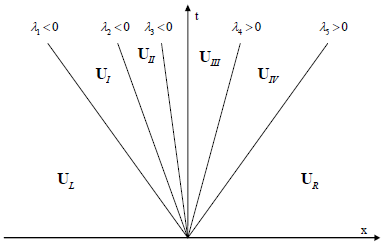

# Riemann Problem

## Background
  The Riemann problem for the hyperbolic, constant coefficient system is a
  special Initial Value Problem (IVP) describes as,

  ```math
  \begin{aligned}
  & \partial_t U + \mathbf{A} \partial_x U = 0 \\
  & U(x,0) = U_0(x) = \begin{cases}
  U_L & \quad \text{if} \quad x < 0 \\
  U_R & \quad \text{if} \quad x > 0
  \end{cases}
  \end{aligned}
  ```

  We assume that the system is strictly hyperbolic, meaning the eigenvalues
  of the Jacobian matrix $`\mathbf{A} = \partial_{u_j} f_i`$ are real and
  distinct,

  ```math
  \lambda_1 < \lambda_2 < ... < \lambda_m
  ```

  The structure of the solution of the Riemann problem in the $`x-t`$ plane is
  shown below,

  

  The solution consists of waves emerging from the origin, one for each
  eigenvalue $`\lambda_i`$ (wave propagation speeds).
