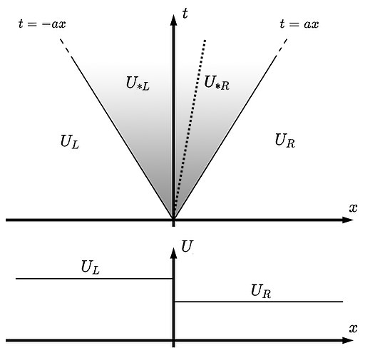
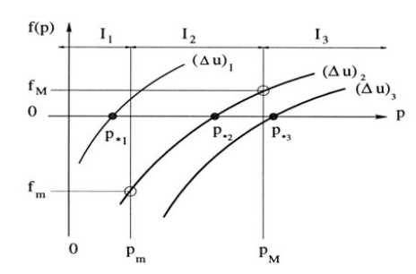

# Riemann Problem
  A Riemann problem is an Initial Value Problem (IVP) composed of a
  conservation law together with piecewise constant data having a discontinuity
  at the centre.

  A Riemann problem can be described as,

  ```math
  \begin{aligned}
  & \partial_t U + \mathbf{A} \partial_x U = 0 \\
  & U(x,0) = U_0(x) = \begin{cases}
  U_L & \quad \text{if} \quad x < 0 \\
  U_R & \quad \text{if} \quad x > 0
  \end{cases}
  \end{aligned}
  ```

  Here, we assume that the system is strictly hyperbolic, meaning the
  eigenvalues of the Jacobian matrix $`\mathbf{A} = \partial_{u_j} f_i`$ are
  real and distinct,

  ```math
  \lambda_1 < \lambda_2 < ... < \lambda_m
  ```

  

  The structure of the solution of the Riemann problem in the $`x-t`$ plane is
  shown in the figure above. The solution consists of
  waves emerging from the origin, one for each eigenvalue $`\lambda_i`$
  (which one can consider them as wave propagation speeds).

## Special Case: Euler Conservation Equations
  Consider the following one-dimensional time-dependent Euler conservation
  equations,

  ```math
  \partial_t U + \partial_x F(U) = 0
  ```

  Here, $`U`$ is the vector of conservative variables and $`F(U)`$ is the
  vector of the fluxes. In 1D, one can write the conserved variables as,

  ```math
  U = \begin{bmatrix}
  \rho \\
  \rho u \\
  E
  \end{bmatrix},\quad F(U) = \begin{bmatrix}
  \rho u \\
  \rho u^2 + p \\
  u (E + p)
  \end{bmatrix}
  ```

  where $`E = \frac 1 2 \rho u^2 + e_{int}`$ and $`e_{int}`$ is the internal
  energy (calculated based on the EOS).

  Considering the following initial condition,

  ```math
  U(x,t=0) = \begin{cases}
    U_L & \quad \text{if} \quad x < 0 \\
    U_R & \quad \text{if} \quad x > 0
  \end{cases}
  ```

  (where $`U_L`$ and $`U_R`$ have constant value over the domain of interest)
  with an ideal gas equation of state,

  ```math
  e = \frac{p}{(\gamma - 1) \rho}
  ```

  we can set up a Riemann problem. The solution of this Riemann problem
  directly depends on the $`x/t`$ ratio and consists of three types of waves,
  - one linearly degenerate wave (the contact discontinuity)
  - two nonlinear waves (shocks or rarefactions),

  Contact discontinuities are surfaces that separate zones of different density
  and temperature at fixed pressure. By definition such a surface is in pressure
  equilibrium, and no gas flows across it. Usually, when the tangential
  components of velocity on one side differs considerably from that of the gas
  on the other side, the surface is called a slip discontinuity. The boundary
  of a supersonic jet and the ambient gas is an example of a slip discontinuity.

  The two types of nonlinear waves (shocks and rarefactions) arise from abrupt
  changes in pressure. Shock fronts accompany compression of the medium and
  rarefactions accompany expansion of the medium.

  These waves are separating four constant states where the conservative
  vector $`U`$ acquires from the left to the right the following values,
  $`U_L`$, $`U_{*L}`$, $`U_{*R}`$ and $`U_R`$.
  The symbol $`*`$ identify points located in the star region between the
  nonlinear waves.

  

  **Equation for Pressure and Particle Velocity in the star region**
  The solution for pressure $`p_*`$ of the Riemann problem with the ideal
  gas equation of state is given by the root of the following algebraic
  equation, which is called the **pressure function**,

  ```math
  f(p, W_L, W_R) \equiv f_L(p,W_L) + f_R(p, W_R) + \Delta u = 0,
  \quad \Delta u \equiv u_R - u_L
  ```

  where $`f_K`$ for $`k \in [L, R]`$ is given by:

  ```math
  f_K \left(p, W_K\right) = \begin{cases}
    (p - p_K) \sqrt{(\frac{A_K}{p + B_K})}
    & \text{if}\quad p > p_K \quad \text{shock} \\
    & \\
    \frac{2 c_{sK}}{\gamma - 1} \left[
      \left( \frac{p}{p_K} \right)^{\frac{\gamma - 1}{2 \gamma}} - 1
    \right]
    & \text{if}\quad p < p_K \quad \text{rarefaction}
  \end{cases}
  ```

  and represent relations across the left and the right nonlinear waves and

  ```math
  A_K = \frac{2}{(\gamma + 1) \rho_K}, \quad
  B_K = \frac{\gamma - 1}{\gamma + 1} p_K
  ```

  The solution for particle velocity $`u_*`$ in the star region is,

  ```math
  u_* = \frac 1 2 (u_L + u_R) + \frac 1 2 \left[ f_R(p_*) - f_L(p_*) \right]
  ```

  The remaining unknowns are found by using standard gas dynamics relations.

  **Deriving relations for nonlinear waves**
  In order to find $`f_K`$ for a shock wave, we move to a frame of
  reference moving at the shock velocity and we introduce the relative
  velocities as,

  ```math
  \hat{u}_K = u_K - S_K, \quad \hat{u}_* = u_* - S_K
  ```

  Then, by using substituting Rankine-Hugoniot conditions,

  ```math
  \begin{aligned}
    \rho_K \hat{u}_K &= \rho_* \hat{u}_* \\
    \rho_K \hat{u}_K^2 + p_K &= \rho_* \hat{u}_*^2 + p_* \\
    \hat{u}_K (\hat{E}_K + p_K) &= \hat{u}_* (\hat{E}_* + p_*)
  \end{aligned}
  ```

  we derive the relation for a shock $`f_K`$.

  In the case of a rarefaction wave, $`f_K`$ can be derived by assuming the
  isentropic relation

  ```math
  p = C \rho^{\gamma}, \quad C = p_K / \rho_K^{\gamma}
  ```

  from which we write,

  ```math
  \rho_{*K} = \rho_K \left( \frac{p_*}{p_K} \right)^{\frac 1 \gamma}
  ```

  and Generalised Riemann Invariant

  ```math
  I_K(u, c_s) = u_K + \frac{2 c_{sK}}{\gamma - 1}
  ```

  which is constant across a rarefaction wave, so we can write,

  ```math
  \begin{aligned}
    & u_L + \frac{2 c_{sL}}{\gamma - 1} = u_* + \frac{2 c_{s*L}}{\gamma - 1} \\
    & u_* - \frac{2 c_{s*R}}{\gamma - 1} = u_R - \frac{2 c_{sR}}{\gamma - 1}
  \end{aligned}
  ```

  where,

  ```math
  c_{s*K} = c_{sK} \left(
    frac{p_*}{p_K}
  \right)^{frac{\gamma - 1}{2 \gamma}}
  ```

  **Behaviour of the Pressure Function**
  In order to investigate the behaviour of the pressure function at a given
  data ($`u_L = (\rho_L, u_L, p_L)^T`$ and $`u_R = (\rho_R, u_R, p_R)^T`$), we
  need to calculate the first and the second derivative of the function w.r.t
  $`p`$. Based on the first derivative,

  ```math
  f^{\prime}_K =
  \begin{cases}
    (\frac{A_K}{p + B_K})^{1/2}
    \left(
      1 - \frac{p - p_K}{2 (B_k + p)}
    \right) & \text{if}\quad p > p_K \quad \text{shock} \\
    & \\
    \frac{1}{\rho_K c_s^K}
    \left(
      \frac{p}{p_K}
    \right)^{\frac{- (\gamma + 1)}{2 \gamma}}
    & \text{if}\quad p \leq p_K \quad \text{rarefaction}
  \end{cases}
  ```

  as $`f^\prime = f_l^\prime + f_r^\prime`$ and $`f_k^\prime > 0`$, we can
  see that the pressure function is monotone.

  Considering the second derivative

  ```math
  f^{\prime\prime}_K =
  \begin{cases}
  \frac 1 4 \left( \frac{ A_K }{ p + B_K } \right)^{1/2}
  \left[
    \frac{ 4B_K + 3p + p_K }{ ( B_K + p )^2 }
  \right]
  & \text{if}\quad p > p_K \quad \text{shock} \\
  & \\
  - \frac{ (\gamma - 1) c_{sK} }{ 2 \gamma^2 p_K^2 }
  \left(
    \frac{ p }{ p_K }
  \right)^{ - ( 3\gamma + 1 ) / 2\gamma }
  & \text{if}\quad p \leq p_K \quad \text{rarefaction}
  \end{cases}
  ```

  since $`f^{\prime\prime} = f_l^{\prime\prime} + f_r^{\prime\prime}`$
  and $`f_k^{\prime\prime} < 0`$, the pressure function is concave down.

  The following figure shows the behaviour of the pressure function in the
  solution of the Riemann problem,

  

  In the figure above, we define,

  ```math
  \begin{aligned}
    & p_{\text{min}} = \text{min}(p_L, p_R) \\
    & p_{\text{max}} = \text{max}(p_L, p_R) \\
    & f_{\text{min}} = f(p_{\text{min}}) \\
    & f_{\text{max}} = f(p_{\text{max}})
  \end{aligned}
  ```

  For given $`p_L`$ and $`p_R`$, it is the velocity differece $`\Delta u`$
  which determines the value of $`p_*`$. Three intervals $`I_1`$, $`I_2`$ and
  $`I_3`$ can be identified:

  ```math
  \begin{aligned}
    & p_*\quad\text{lies in}\quad I_1 = (0, p_{\text{min}})\quad
    &\text{if}\quad f_{\text{min}} > 0\quad\text{and}\quad f_{\text{max}} > 0\\
    & p_*\quad\text{lies in}\quad I_2 = [p_{\text{min}}, p_{\text{max}}]\quad
    &\text{if}\quad f_{\text{min}} \leq 0\quad\text{and}\quad f_{\text{max}} \geq 0\\
    & p_*\quad\text{lies in}\quad I_3 = (p_{\text{max}}, \infty)\quad
    &\text{if}\quad f_{\text{min}} < 0\quad\text{and}\quad f_{\text{max}} < 0
  \end{aligned}
  ```

  For suficiently large $`\Delta u`$ as in $`(\Delta u)_1`$, the value of
  $`p_*`$ lies in the $`I_1`$ region and since the root of the pressure
  function is less than $`p_L`$ and $`p_R`$, we end up having two rarefactions.
  We can follow the same logic to explain $`(\Delta u)_2`$ and $`(\Delta u)_3`$.

  For a positive solution for pressure $`p_*`$ we require $`f(0) < 0`$. This
  leads to the pressure positivity condition,

  ```math
  (\Delta u)_{\text{crit}}
    \equiv \frac{2 c_{sL}}{\gamma -1} + \frac{2 c_{sR}}{\gamma -1}
    > u_R - u_L
  ```

  Note that vacuum is created by the nonlinear waves if this condition
  is violated.
